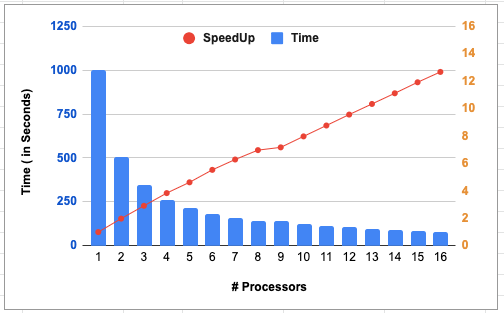

# HPC_OpenMPI

The Conway Game of Life is a zero-player game, which means that its evolution is determined by its
initial state and requires no input from the human player. The universe of the Game of Life is an
infinite grid of two-dimensional orthogonal squares, each of which (at any given time) is in one of two
possible states, ’alive’ or ’dead.’ Each cell interacts with its eight neighbors, which are cells directly
adjacent horizontally, vertically, or diagonally. At each step in time, the following transitions occur.
1. Any living cell with fewer than two live neighbors dies (known as underpopulation or exposure
[2]).
2. Any living cell with more than three living neighbors dies (known as overpopulation or over-
crowding).
3. Any living cell with two or three neighbors will pass on to the next generation unchanged.
4. Any dead cell with exactly three living neighbors will turn to alive.
While implementing the “Game of Life,” we have experimented with the performance in various
aspects. The goal of all the experiments was to increase the speed-up of the program on different
numbers of threads and draw a speed-up curve. We have also tested our implementation by testing
the expected outcomes for patterns such as “Beehive”, “Glider,” and “Grower.”

## How to compile
To compile the main program run the following command:

```
sbatch compile
```

Or you can directly run the following commands

```
module load 2020
module load GCC/9.3.0

gcc -fopenmp -o pmap pmap.c -lm
```


## How to run

To run the program, you can use the `sbatch` command.
```
sbatch job.sh
```

## Speedup curve - [5000 generations and 3000X3000 table]

To improve the speedup of our implementation, we tried to run our program with multiple nodes and
tasks [1...16]. We observed that, by increasing the number of nodes, there is a reduction in the “overall”
time taken to run the program, but we did not see any significant change speed-up curve. Following
is the speedup curve generated based on the time taken to run our program from 1..16 threads.



### increasing the number of nodes
As the number of threads increases, the time taken to complete the program is not in the same ratio.
This is because all parts of our program cannot run in parallel, and therefore, according to Amdahl’s
law, the speedup ratio is not 16 when the total number of threads is 16. It is less than that.
Figure 3: Caption
By increasing the nodes from 1..4..8..16, there was a reduction in total time taken by the program,
but there was almost no impact on the speedup ratio, as shown in Figures 2 and 3.
4 Reference
Here is the code repository link - https://github.com/sprucy/HPCO penM P I


